# Modular VAE Demo

A clean PyTorch demo of Variational Autoencoders as modular probabilistic latent representation learning.

```text
x -> Encoder -> mu, logvar -> q_phi(z|x) -> z -> Decoder -> x_hat
                                |
                              p_psi(z)
```

The fixed part is the probabilistic interface. The replaceable parts are the encoder backbone, decoder backbone, prior, and ELBO configuration.

## Results

All experiments use MNIST. Checkpoints are not committed; the repository keeps only lightweight figures and evaluation summaries.

| Experiment | Backbone | Prior | KL mode | Loss | Recon | KL |
| --- | --- | --- | --- | ---: | ---: | ---: |
| MLP VAE | MLP | Standard normal | Analytic | 100.05 | 79.98 | 20.07 |
| CNN VAE | CNN | Standard normal | Analytic | 95.98 | 75.31 | 20.67 |
| Beta-VAE | MLP | Standard normal | Analytic | 142.58 | 107.85 | 8.68 |
| Transformer VAE | Patch Transformer | Standard normal | Analytic | 96.04 | 73.92 | 22.13 |
| Flow-prior VAE | MLP | RealNVP-style flow | Monte Carlo | 95.75 | 75.99 | 19.76 |

| Experiment | Reconstructions | Prior samples |
| --- | --- | --- |
| MLP VAE | 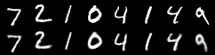 | 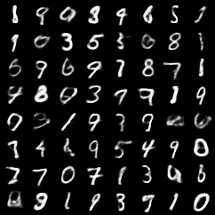 |
| CNN VAE | 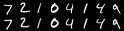 | 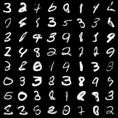 |
| Beta-VAE | 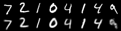 | 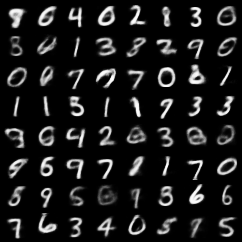 |
| Transformer VAE | 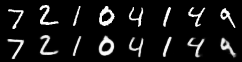 | 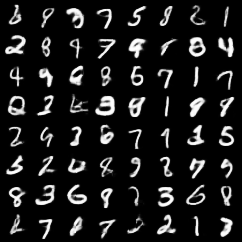 |
| Flow-prior VAE | 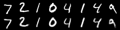 | 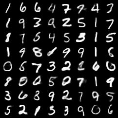 |

MLP VAE training curves:

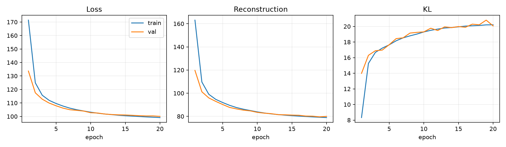

Full metric YAML files live in [`assets/results`](assets/results).

## Probabilistic Model

A VAE does not encode an image into a deterministic vector. The encoder parameterizes an approximate posterior:

$$
q_\phi(z \mid x) = \mathcal{N}\left(z; \mu_\phi(x), \mathrm{diag}(\sigma_\phi^2(x))\right)
$$

Sampling is written with the reparameterization trick:

$$
\epsilon \sim \mathcal{N}(0, I), \qquad z = \mu_\phi(x) + \sigma_\phi(x) \odot \epsilon
$$

The training objective is the negative ELBO:

$$
\mathcal{L}(x) = \mathbb{E}_{q_\phi(z \mid x)}\left[-\log p_\theta(x \mid z)\right] + \beta\,\mathrm{KL}\left(q_\phi(z \mid x) \Vert p_\psi(z)\right)
$$

For the standard Gaussian prior,

$$
p(z) = \mathcal{N}(0, I)
$$

the diagonal Gaussian KL is analytic:

$$
\mathrm{KL}\left(q_\phi(z \mid x) \Vert \mathcal{N}(0,I)\right) = \frac{1}{2}\sum_j\left(\mu_j^2 + \sigma_j^2 - 1 - \log \sigma_j^2\right)
$$

For learned or nonstandard priors, the KL is estimated with one posterior sample:

$$
\mathrm{KL}\left(q_\phi(z \mid x) \Vert p_\psi(z)\right) \approx \log q_\phi(z \mid x) - \log p_\psi(z), \qquad z \sim q_\phi(z \mid x)
$$

The flow prior transforms a standard Gaussian base variable:

$$
u \sim \mathcal{N}(0,I), \qquad z = f_\psi(u)
$$

Its density is computed by change of variables:

$$
\log p_\psi(z) = \log p_0(f_\psi^{-1}(z)) + \log\left|\det\frac{\partial f_\psi^{-1}}{\partial z}\right|
$$

The Transformer VAE in this repository is not a different probabilistic model. It is only a patch-based backbone behind the same posterior, sampling, prior, and ELBO interface.

## What Is Modular

- Posterior: `DiagonalGaussian`
- Prior: `StandardNormalPrior` or `FlowPrior`
- Encoder backbone: MLP, CNN, or patch Transformer
- Decoder backbone: MLP, CNN, or patch Transformer
- Objective: standard VAE, beta-VAE, analytic KL, or Monte Carlo KL

The main `VAE` class only knows how to:

```text
encode(x) -> q_phi(z|x)
sample z
decode(z) -> x_hat
```

Everything else is configured from YAML.

## Quick Use

Install PyTorch for your machine, then install the remaining dependencies:

```bash
uv venv --python 3.12
source .venv/bin/activate
uv pip install torch torchvision --index-url https://download.pytorch.org/whl/cu128
uv pip install -r requirements.txt
```

Run all experiments:

```bash
bash scripts/run_all_experiments.sh
```

Run one experiment:

```bash
python -m vae.train --config configs/mnist_mlp_standard.yaml
```

Generate evaluation and figures:

```bash
python -m vae.evaluate --checkpoint outputs/mnist_mlp_standard/checkpoint.pt
python -m vae.visualize --checkpoint outputs/mnist_mlp_standard/checkpoint.pt
```

## Project Map

```text
configs/                  YAML experiment configs
vae/distributions.py       DiagonalGaussian posterior
vae/priors.py              Standard normal and flow priors
vae/flows.py               RealNVP-style affine coupling flow
vae/losses.py              ELBO / beta-VAE objective
vae/builders.py            Config-driven component builders
vae/models/                MLP, CNN, and Transformer backbones
vae/train.py               Training entry point
vae/evaluate.py            Test-set evaluation
vae/sample.py              Prior sampling
vae/visualize.py           Figures and latent interpolation
docs/                      Short conceptual notes
assets/                    Published figures and metrics
```

## Documentation

- [VAE overview](docs/vae_overview.md)
- [ELBO](docs/elbo.md)
- [Reparameterization](docs/reparameterization.md)
- [Flow prior](docs/flow_prior.md)

## License

MIT.
